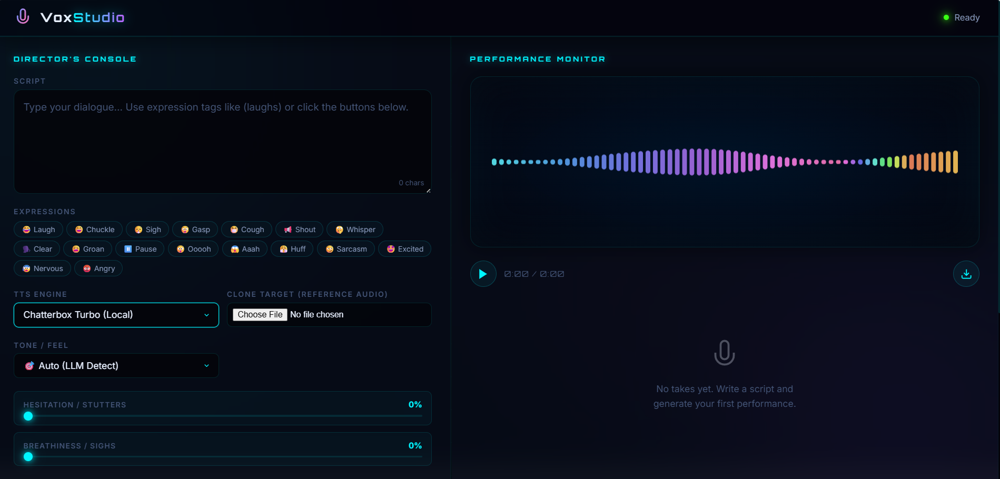

# 🎙️ VoxStudio: Professional AI Voice Acting Engine



VoxStudio is a premium, intent-aware AI voice acting studio designed for directors and creators. It combines the power of cloud-based synthesis (ElevenLabs) with high-performance local inference (Chatterbox Turbo) to provide a complete toolkit for cinematic dialogue generation.

## ✨ Key Features

*   **Director's Console**: A professional-grade interface for fine-tuning performances with real-time feedback.
*   **Intent-Aware AI**: Uses LLM logic to analyze your script and automatically apply the perfect tone, emotion, and pacing.
*   **Dual-Engine Architecture**:
    *   **Chatterbox Turbo (Local)**: High-speed, private, zero-shot voice cloning with support for paralinguistic tags like `[laugh]`, `[sigh]`, and `[gasp]`.
    *   **ElevenLabs (Cloud)**: Industry-leading voice quality with deep stability and similarity controls.
*   **Studio Midnight UI**: A stunning, high-performance interface featuring glassmorphism, neon accents, and animated backgrounds.
*   **Pro Mastering Chain**: Integrated FFmpeg pipeline providing automatic EQ, Compression, and Noise Gating for broadcast-ready audio.
*   **Multilingual Support**: High-fidelity cloning in English, Hindi, Spanish, French, German, and more.

## 🛠️ Technology Stack

*   **Backend**: Python 3.10+, FastAPI, Uvicorn
*   **Local TTS**: Chatterbox Turbo (Base & Multilingual)
*   **Cloud TTS**: ElevenLabs API
*   **Audio Processing**: FFmpeg, Librosa, Pydub
*   **Frontend**: Vanilla JS, Glassmorphism CSS, HTML5 Semantic Structure

## 🚀 Getting Started

### 1. Prerequisites
*   **Python 3.10+** installed.
*   **FFmpeg** installed and added to your system PATH (or updated in `server.py`).
*   **NVIDIA GPU** (RTX 30-series or higher recommended for Chatterbox local inference).

### 2. Installation

1.  Clone the repository and navigate to the project directory:
    ```powershell
    cd AudioLab/voice_actor_module
    ```

2.  Create and activate a virtual environment:
    ```powershell
    python -m venv venv
    .\venv\Scripts\activate
    ```

3.  Install dependencies:
    ```powershell
    pip install -r requirements.txt
    ```

4.  Set up your ElevenLabs API Key:
    Create a file named `elevenlabs.key.txt` in the project root and paste your key inside.

### 3. Model Setup (Chatterbox)
Download the local model weights (Base + Multilingual) into your project directory to avoid filling up your C: drive:
```powershell
python download_model.py
```

### 4. Running the Studio
Launch the server:
```powershell
python server.py
```
Open your browser to `http://127.0.0.1:8000`.

## 🎮 How to Use

1.  **Select your Engine**: Choose between ElevenLabs (Cloud) or Chatterbox Turbo (Local).
2.  **Write your Script**: Use the expression palette to inject cinematic tags like `[laugh]` or `[sigh]`.
3.  **Direct the Voice**: Adjust the AI Director sliders for Emotion Intensity, Spontaneity, and Clone Fidelity.
4.  **Upload a Reference**: For Chatterbox, upload any audio or video file (.mp4) to clone a specific voice instantly.
5.  **Generate & Master**: Click "Generate Take" to see the AI analyze your intent and produce a mastered, studio-quality WAV file.

---
*Built with ❤️ by the VoxStudio Team*
